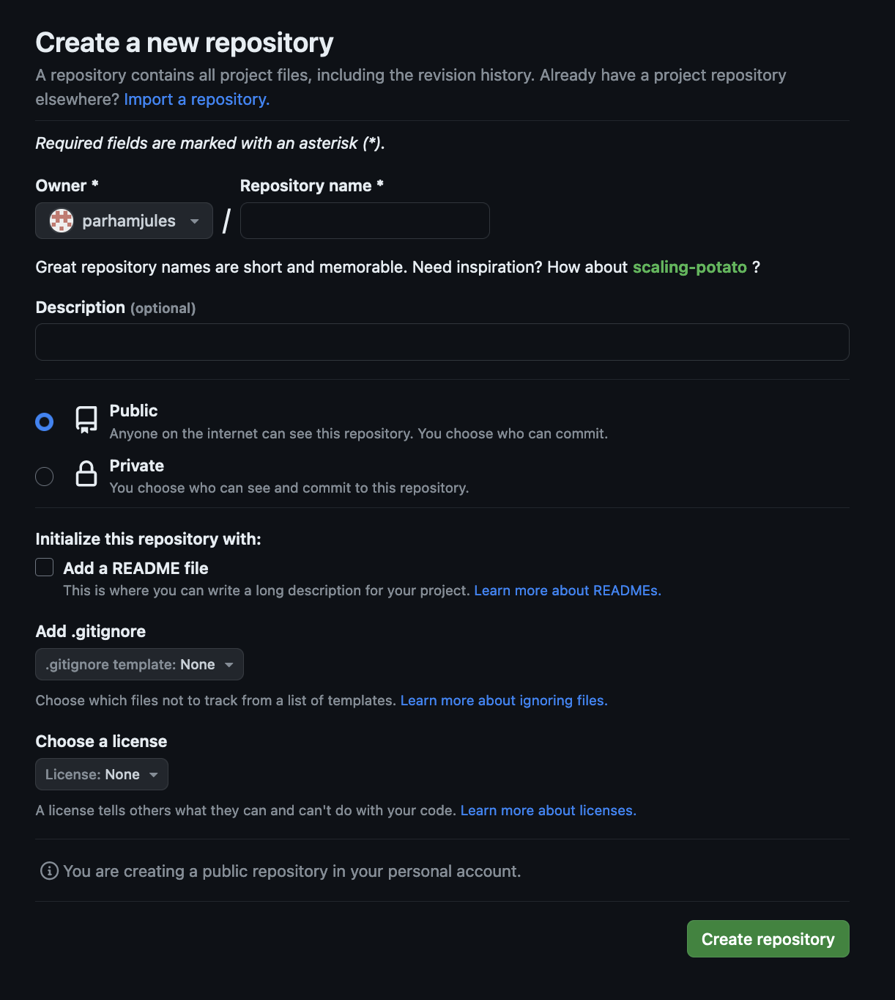

# Creating Repositories

[Previous - Setting Up SSH Keys](./ssh_key.md)

The first step of creating a new repository, or *repo* for short, is to
create it in GitHub.

## Creating the Repo in GitHub

Creating a repo in GitHub is a simple single-page form. There are a few options
on this form, the most important of which is giving the repo a name, and
determining whether it is public or private.



## Working on the Repo

There are a few ways to begin working on your new repository.

### Clone

You can use the **clone** command to quickly setup the new repo in a
directory on your computer.

`git clone url_provided_by_github`

Running this command will create a new directory with the same name as the
repository. If you want to clone the repo into an existing folder, without
creating a new one, you can use the augmented **clone** command below:

`git clone url_provided_by_github .`

### Init

If you already have project files on your computer, and simply want to link
your current project directory to your new repo, you can use the chain of
commands below:

```
git init
git add .
git commit -m "initial commit message"
git branch -M main_or_master_branch_name
git remote add origin url_provided_by_github
git push -u origin main_or_master_branch_name
```

[Next - Command Line Basics](./command_line_basics.md)
