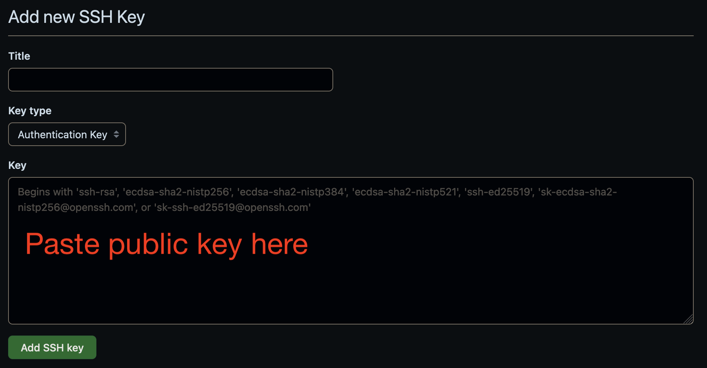

# Setting Up SSH Keys

[Previous - Installing Git](./installing_git.md)

There are a few different ways to work on GitHub repositories, possibly the
easiest of which is to add an SSH key to your GitHub account for each device
you work on.

### Creating New SSH Keys

To generate a new SSH key, run the following command in a terminal or command prompt:

`ssh-keygen -t ed25519 -C "your_email@example.com"`

This command will prompt you for a file path, with the default being to put the
files in the *.ssh* directory in your user folder.

If you are on a legacy system, you may need to generate your key using the RSA
algorithm rather than Ed25519, using the following command:

`ssh-keygen -t rsa -b 4096 -C "your_email@example.com"`

Once your key has been created, there will have been two files generated on
your computer: a public and private key file. Whenever adding your SSH key
to an external service, you will always use the public file (the filename ending in *.pub*).
You should never put the private file anywhere else other than on your computer.

### Adding Key to GitHub

To manage the SSH keys associated with your account, visit your [account settings](https://github.com/settings/keys).

Click the **New SSH key** button, which will take you to a form to paste your newly-created key.

In the new SSH key form, you can give the key a **Title**. It is recommended to title the
key after the device that it goes to. Leave **Key type** as **Authentication Key**, then paste
your public key into the **Key** field.

To get your public key, use the following command in terminal or command prompt:

`cat ./path/to/key/my_new_key.pub`

Click the **Add SSH key** to save your key in GitHub.

[Next - Creating Repositories](./creating_repo.md)
